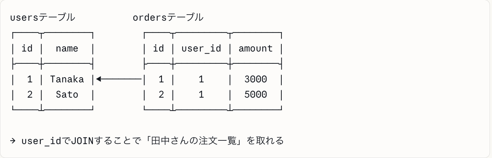

# データベースについて
## データベースの分類
データベースは、**SQL（リレーショナルDB）**と**NoSQL**の2つに分けられます

**SQL**とは、データを表（テーブル）で管理し、テーブル同士を関係（リレーション）で結ぶ仕組みです。

**NoSQL**とは、表の形に縛られず、JSON形式などで柔軟にデータを持てますが、複雑なクエリは苦手という特徴があります。

##### 有名サービスの整理
|サービス|種類|エンジン|特徴|
|---|---|---|---|
|Aurora|SQL|MySQL,PostgreSQL互換|AWSが独自改良。速度が通常の５倍|
|RDS|SQL|MySQL,PostgreSQL,Oracleなど||
|DynamoDB|NoSQL|独自|AWSフルマネージド。超スケール向き|
|Oracle DB|SQL|独自|企業向け老舗。ライセンスが高額|
|MongoDB|NoSQL|ドキュメント型|JSONライクで柔軟。スタートアップに人気|

##### PostgreSQLとMySQLの違い
どちらもSQLだが、**方言が違う**イメージ。
||PostgreSQL|MySQL|
|---|---|---|
|複雑なクエリ|◎得意|△やや苦手|
|速度（単純読み取り）|⚪︎|◎|
|JSON対応|◎ネイティブ対応|⚪︎|
|採用企業|Instagram,Snapchat|WordPress,Twitter|

## AuroraとRDSの設定・セキュリティ
