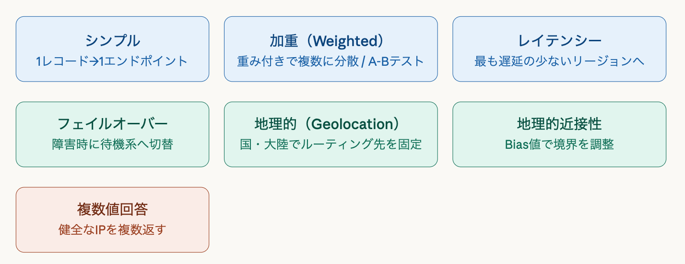

# Route53
### 全体概要
AWSが提供するマネージドDNSサービスで、名前の通り「ポート53（DNSポート）」に由来します。単なるDNSリゾルバではなく、ドメイン登録・DNSルーティング・ヘルスチェックの3機能を一体で持つのが特徴です。
SLAは100％で、AWSの中でも珍しく、完全可用性を保証するサービスです。

### 主要コンセプト
Hosted Zone(ホストゾーン)とは、DNSレコードのコンテナです。`snapi.com`というドメインなら、そのすべてのDNS設定をここで管理します。パブリック（インターネット向け）とプライベート（VPC内向け）の２種類があります。

AliasレコードはRoute53独自の拡張機能で、ELBやCloudFrontなどAWSリソースのエンドポイントにCNAMEのように向けられます。CNAMEと違ってゾーンApexでも使える点が重要です。また、Aliasへのクエリは課金されません。

#### DNSレコードとは
DNSレコードとは、ドメイン名に対して、どこへ接続するか・何の用途かを定義する情報です。一言で言うとドメインの設定表のようなものです。

**Aレコード**：A(Address)レコードとは、ドメイン名をIPv4アドレスに対応づけるレコードです。
例：`example.com → 192.0.2.1`
最も基本的なDNSレコードで、WebサーバーのIPを直接指定したいときに使います。

**AAAAレコード**：AAAAレコードとは、AレコードのIPv6版で、ドメイン名をIPv6アドレスに対応づけるレコードです。
例：`example.com → 2001:db8::1`

**CNAMEレコード**：CNAME(Canonical Name)レコードとは、あるドメイン名を別のドメイン名に向けるレコードです。
例：`www.example.com → example.com`、`app.example.com → d123abcd.cloudfront.net`
サブドメインを別名に向けたいときに使用しますが、ゾーンApexには通常CNAMEを置けないため、Route53では**ALIAS**を使用します。（`example.com`にはCNAME不可）

**TXTレコード**：TXT(text)レコードとは、ドメインに文字列情報を持たせるためのもので、ドメイン所有確認や各種外部サービスの認証用に使います。
例：Google Search Consleの所有確認、SESの認証、メールのなりすまし防止設定。

**MXレコード**：MX(Mail Exchange)レコードとは、そのドメイン宛のメールをどのメールサーバーで受け取るかを定義するレコードです。メールの受信先を表します。
例：`example.com`宛メール→Google Weorkspaceのメールサーバーへ
独自ドメインでメールを受信するとき(info@snapi.photoなど)に設定します。

**NSレコード**：NS(Name Server)レコードとは、そのドメインを管理するDNSサーバーがどれかを示すレコードです。そのドメインの管理者が誰かを表します。
例：`snapi.photo`のNSがRoute53のネームサーバーを指す。
NamecheapでとったドメインをRoute53に向ける時もここを設定します。

**SOAレコード**：SOA(Start of Authority)レコードとは、そのDNSゾーンの基本情報を持ち、DNSゾーンの管理情報を表示します。管理者情報やシリアル番号が入っており、普段あまり手で触らないレコードです。ホストゾーン作成時に自動で入ることが多いです。

### ルーティングポリシー
ルーティングポリシーとはDNSリクエストを「どの宛先に振り向けるか」を決めるルールのことです。
**例**：同じドメイン（`example.com`）に対して東京とシンガポールの2つのAレコードを設定すると、アクセス先はランダムに決まる。  
このとき「どのサーバーに振り分けるかのルール」を指定するのがルーティングポリシー。

以下の７種類があります。

**シンプル**：1つのリソースにそのままルーティングすることで、普通のAレコードと同じ最もシンプルなDNSです。常に同じ宛先を返します。
**加重(Weighted)**：複数リソースに重みをつけて分散させるルーティングです。A(80%),B(20%)など設定した比率でトラフィックを振り分けることができます。カナリアデプロイやABテストに用いられます。ヘルスチェックと組み合わせが可能です。
**レイテンシー(Latency)**：ユーザーにとって最も応答が早いリージョンにルーティングする方法です。AWSのネットワーク遅延データをもとに判断されます。
例：
・日本ユーザー→東京リージョン
・USユーザー→バージニアリージョン
物理的距離ではなく、実測レイテンシをもとにルーティングされ、「最速体験を提供するためのルーティング」と言えます。
**フェイルオーバー(Failover)**：障害時に別のリソースへ切り替えるルーティングのことです。PrimaryとSecondary（障害時）を設定します。ヘルスチェックでPrimaryを監視し、異常時のみSecondaryに切り替えます。高可用性や災害対策のために使用され、「止まらないしくみ」を実現するものと言えます。Primary復活で自動復旧されることもポイントです。
**地理的(Geolocation)**：ユーザーの国や地域で振り分ける方法です。IPアドレスから国を判定し、日本なら東京サーバー、EUなら欧州サーバーなどのように振り分けます。言語別サイトやGDPRなどの法規制対応のために使用されます。
**地理的近接性(Geoprocimity+Bias)**：距離に応じてルーティングしつつ、Biasで調整する方法です。基本は近いリージョンに流しつつ、Biasで多めに流すなど調整することができます。トラフィック分散調整や特定リージョン強化のために用いられます。
**複数値回答(Multivalue Answer)**：最大8つまでの正常なIPを返す方法です。（ヘルスチェックで異常なものは除外されます）。

### ヘルスチェック
ヘルスチェックとは、サーバーやサービスが正常に動いているかを監視する仕組みです。
監視対象は以下の3種類があります。
**1. エンドポイント監視**
　エンドポイント監視とはWebサーバーやAPI（IP/ドメイン）にHTTP/HTTPS/TCPでリクエストを送り、正常応答か確認する方法です。
例：HTTP200が返るか

**2. CloudWatchアラーム連携**
CPU使用率やエラー率などのメトリクスをもとに、正常か異常かを判定する方法です。サーバー状態を間接的に監視しています。

**3. 計算済みヘルスチェック**
他のヘルスチェックの結果を組み合わせて判定する方法です。複数のヘルスチェックをAND/OR/NOTで合成して1つにします。

ヘルスチェックが失敗すると、フェイルオーバールーティングと組み合わせることで、自動的にプライマリ→スタンバイに切り替わります。これが「高可用性DNS設計」のパターンです。

