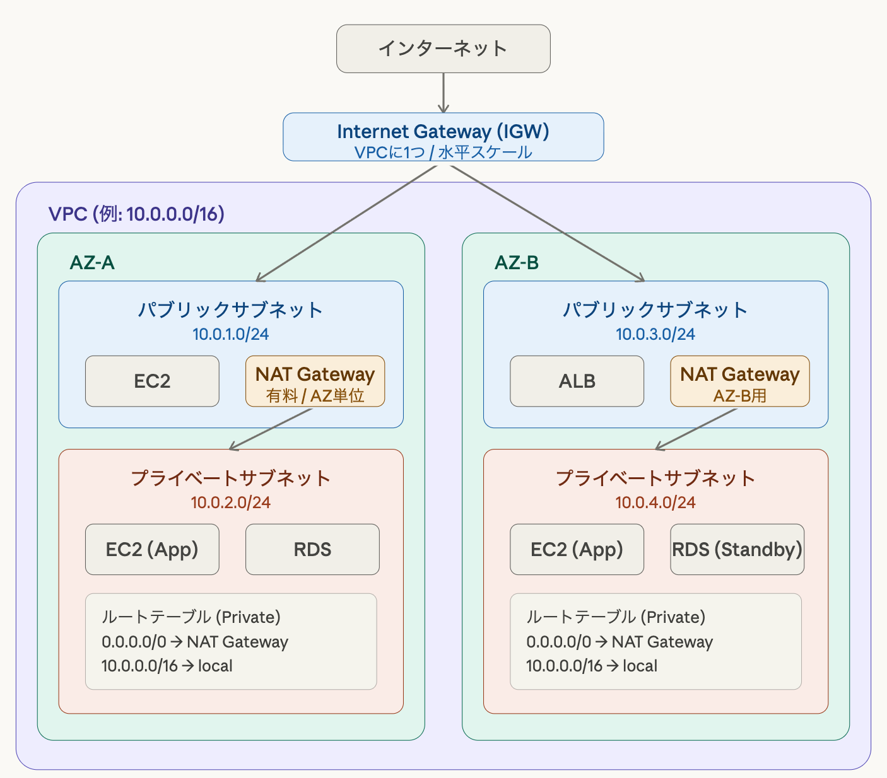

# VPCについて学ぶ
### 前提知識
IPアドレスは「ネットワーク部」と「ホスト部」に分けられ、同じネットワーク部を持つ機器同士が同じネットワークに属します。このネットワークをさらに小さな単位に分割したものがサブネットであり、その範囲を定義する方法がCIDRです。
CIDR(Classless Inter-Domain Routing)は、「IPアドレス/ビット数」で表され、先頭から何ビットをネットワーク部として使うかを示します。例えば`192.168.1.0/24`は先頭24ビットがネットワーク部となり、`192.168.1.1〜192.168.1.254`が同じサブネットに属することを示します。

### VPCとは
VPC(Virtual Private Cloud)とは、AWSクラウド内に作る論理的に隔離されたネットワークのことです。自分専用のデータセンターをクラウド上に持つイメージで、IPアドレス範囲・サブネット・ルーティング・セキュリティをすべて自分でコントロールできます。

VPCはリージョン単位で作成します。１つのリージョンに複数作成することが可能です。デフォルトでは、VPCが各リージョンに1つ自動作成されています。

### サブネット
VPCにおけるサブネットとは、VPCに割り当てられたIPアドレス範囲（CIDR）をさらに分割したネットワークです。各サブネットは特定のAZ(Availability Zone)に属し、1つのサブネットが複数のAZにまたがることはありません。

サブネットはCIDR形式でIPアドレス範囲を指定して作成され、その範囲内のIPアドレスがEC2やRDSなどのリソースに割り当てられます。

用途に応じてパブリックサブネットやプライベートサブネットを設計し、VPC内のネットワーク構成を分離・管理するために用いられます。パブリックサブネットとプライベートサブネットの違いはルートテーブルの設定だけで、IGW(Internet Gateway)へのルートが存在するかどうかで決まります。

**パブリックサブネット**：インターネットと直接通信できるサブネットで、ルートテーブルに「0.0.0.0/0→IGW」があればパブリックサブネットです。EC2などのWebサーバーや外部公開サービスなどが置かれます。

**プライベートサブネット**：インターネットから直接アクセスできないサブネットで、IGWへのルートがありません。データベースやLambdaなどのバックエンドなど、外から隠す場所として用いられます。

**ルートテーブル**：通信の行き先を決める設定のことで、サブネットに紐付き、そのサブネットの通信経路を制御します。

### セキュリティの2層構造

